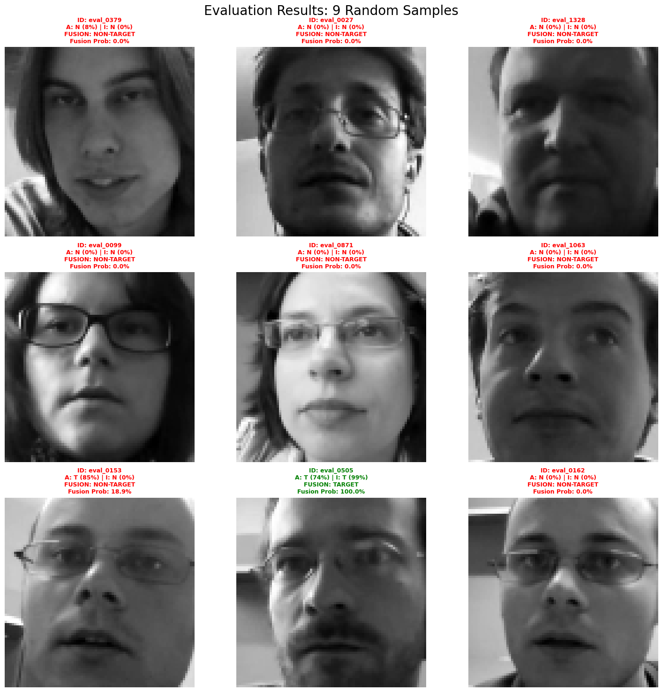
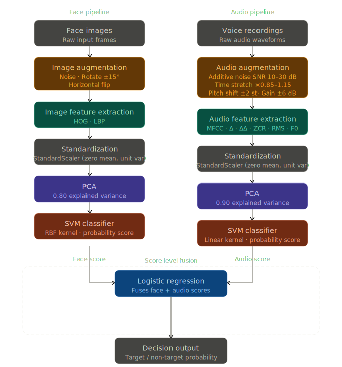

# Person detection

A small end-to-end person detection project trained from scratch on a compact dataset. It includes three separate models:

- `speech` model: predicts from audio input
- `face` model: predicts from face images
- `combined` model: fuses both audio and face data

### Sample result:



### Networks architecture:


## Install
```bash
python3.12 -m venv env
source ./env/bin/activate

pip install -r requirements.txt 
pip install -e .
```

## Train
data required (non_target_dev, non_target_train, target_dev, target_train). Set path using `config.yaml`
```bash
python src/train.py
```

## Inference 
```bash
python src/predict.py paths.eval_dir=<path_to_eval_data>
```